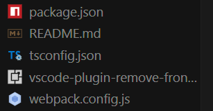

# 1. 初始化

```
 yo code extensionProject
```

package.json 中配置发布者

```bash
"publisher": "lx815",
```

# 2. 编码

在`extension.js`中实现核心逻辑：

# 3. 调试

按下`F5`键，打开插件调试功能

# 4. 发布

```bash
vsce package
```

查询发布账号https://dev.azure.com/2192798424/_usersSettings/tokens

```bash
vsce login lx815
```

准备发布文件夹
创建一个 publish 文件夹，将以下文件复制到文件夹中


进入文件夹终端执行

```bash
vsce publish
```
